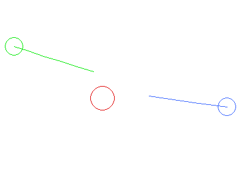
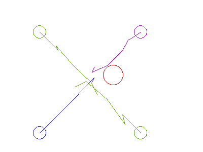

# Gaussian Blief Propagation on Planning

Implementation of factor graph is highly referred to [fglib](https://github.com/danbar/fglib), but also add support to multivariate gaussians and update-able factor node, etc.

Motion planning code is an re-implementation for the paper [Distributing Collaborative Multi-Robot Planning
with Gaussian Belief Propagation](https://arxiv.org/abs/2203.11618). (However NOT finetuned.)

#### Sample for `test_motion.py`

#### Sample for `test_motion_cross.py`

## References

- Papers
    - [Distributing Collaborative Multi-Robot Planning
with Gaussian Belief Propagation](https://arxiv.org/abs/2203.11618)
    - [FutureMapping 2: Gaussian Belief Propagation for Spatial AI](https://arxiv.org/abs/1910.14139)

- Blogs (Tutorials)
    - [A visual introduction to Gaussian Belief Propagation](https://gaussianbp.github.io/)
    - [確率伝播アルゴリズムとは](https://staff.aist.go.jp/y-ichisugi/besom/20100226what-is-bp.pdf)

- Other
    - [Multiplying multivariate Gaussian with a univariate Gaussia](https://stats.stackexchange.com/a/144601/380301)
